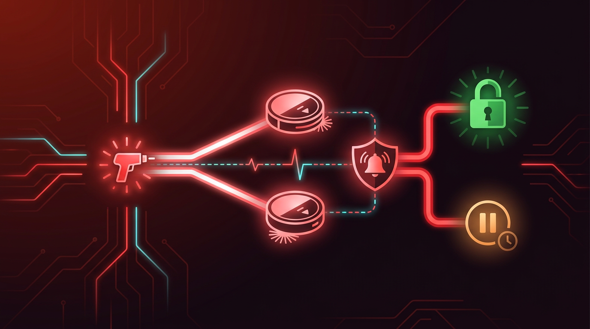

I recently made a small change to my home automation setup: a robot vacuum that used to start on a rigid 10-minute "away" timer should instead wait until a larger geofence is actually crossed — no more triggering just because someone stepped out to the mailbox. A tiny feature. It should have been a ten-minute edit. It was not, because in this house even the vacuum cleaner has opinions about the security system.

## The warning before writing a single line

Before touching any code, I noticed something: right next to the automation that starts the vacuum sits a second one — the security alarm. And the two are coupled through a duplicated piece of logic. The alarm sequence contains a variable that *predicts* whether the vacuum is about to start, in order to decide: arm upstairs immediately, or wait until the vacuum finishes (a motion sensor would otherwise flag the moving robot as an intruder)?



Two independent conditions, deliberately kept identical, deciding two different things.

> That's exactly the kind of coupling that had already caused two real false alarms in the past.

If I extended the vacuum's start condition with the new geofence logic without updating the alarm's copy of that logic in lockstep, I'd introduce a fresh race condition in the single most safety-critical corner of the config. So: flagged the risk, got the go-ahead ("do it, but be extra careful"), and synchronized both conditions word-for-word:

### The synced condition

```yaml
# Both the vacuum-start condition AND the alarm's prediction variable
# use this exact same expression:
value_template: >-
  {{ (trigger.id == 'home_away' and is_state('person.dennis', 'not_home')
  and is_state('person.anni', 'not_home')) or trigger.id ==
  'home_away_sauger_fallback' }}
```

---

## Escalating to three opinions instead of one

Changes to safety-critical areas don't just get a single code review in my setup. There's a standing rule: a dedicated review agent, plus two independent opinions from *different* model providers — genuine diversity, not the same blind spots twice.

Roughly, invoking the second and third opinions looks like this — one default call, one escalated to a stronger model on the same run:

```bash
scripts/external_review.py "geofence change to vacuum-start condition"
scripts/external_review.py --model <stronger-model> "same change, second pass"
```

All three came back with the same verdict: **critical.**

- Model one claimed the prediction formula in the alarm sequence and the actual vacuum-start condition weren't identical.
- Model two made the same claim, backed by a different (also wrong) detail.
- The internal review agent claimed something else entirely: that the zone check only recognized the small 75-meter zone, not the new, larger one — and separately, that a safety property of the automation (`mode: parallel`, allowing two trigger instances to run concurrently without blocking each other) didn't actually exist in the code.

Three independent sources, one converging "critical" alarm.

> Three different companies, three different training runs, one shared hallucination — either impressively bad luck or a surprisingly efficient way to be wrong in stereo.

That's exactly the moment where it's tempting to either trust blindly ("three out of three can't all be wrong") or dismiss blindly ("the AI is exaggerating again, back to my coffee").

---

## Checking instead of believing

Neither. Line-by-line comparison instead.

### What each claim actually turned out to be

| Claim | Verdict |
|---|---|
| Prediction formula ≠ vacuum condition | False — byte-for-byte identical in the same commit |
| Zone check only sees the small 75m radius | False — documented HA behavior: smaller radius wins on concentric zones, working as intended |
| `mode: parallel` missing | False — two lines below where the reviewer apparently stopped reading |

All three "critical" findings: false positives. A clean sweep, in the wrong direction.

---

## The one real finding

But while doing that line-by-line comparison myself, I noticed something none of the three AI opinions had flagged: a comment directly above the automation's triggers claimed the alarm sequence was "exclusively gated to the 10-minute trigger" — the *opposite* of what was actually intended and implemented (the alarm sequence has to react to both triggers, or it reintroduces the exact race condition I'd warned about in the first place). A stale, misleading comment, not a logic bug — but exactly the kind of detail that misleads whoever (human or AI) trusts the comment over the code six months from now.

```yaml
# Before (misleading):
# Light/Cover/Lock stay exclusively gated on home_away (10 min).
# Alarm too.  <-- this part was simply no longer true

# After:
# Light/Cover/Lock stay exclusively gated on home_away (10 min).
# The alarm sequence is deliberately NOT gated — it must react to
# BOTH trigger IDs (see the synced prediction formula above) to
# correctly decide immediate-arm vs. wait-for-vacuum.
```

---

## What I took away from it

Three AI reviews, three false "critical" alarms, one real (if minor) finding that none of them caught. That's not an argument against getting second opinions — it's an argument for treating them as what they are: extra scrutiny, not proof. The value wasn't in trusting the three opinions; it was in the process forcing me to verify every single claim against the actual code — and it was precisely *while* disproving the false positives that the real issue surfaced, not because any review tool found it.

The lesson I'm keeping: for safety-critical code, verifying against ground truth — actual code, actual documented system behavior — always pays off, independent of how many AI voices agree on something. Trust doesn't substitute for checking, no matter how many opinions you stack.

If you want the backstory on why changes like this get three opinions instead of one in the first place, [the introduction post](../welcome/) has the full picture. Next up: [the time a subagent I explicitly told to stay read-only pushed a commit to main anyway](../subagent-pushed-to-main/).
